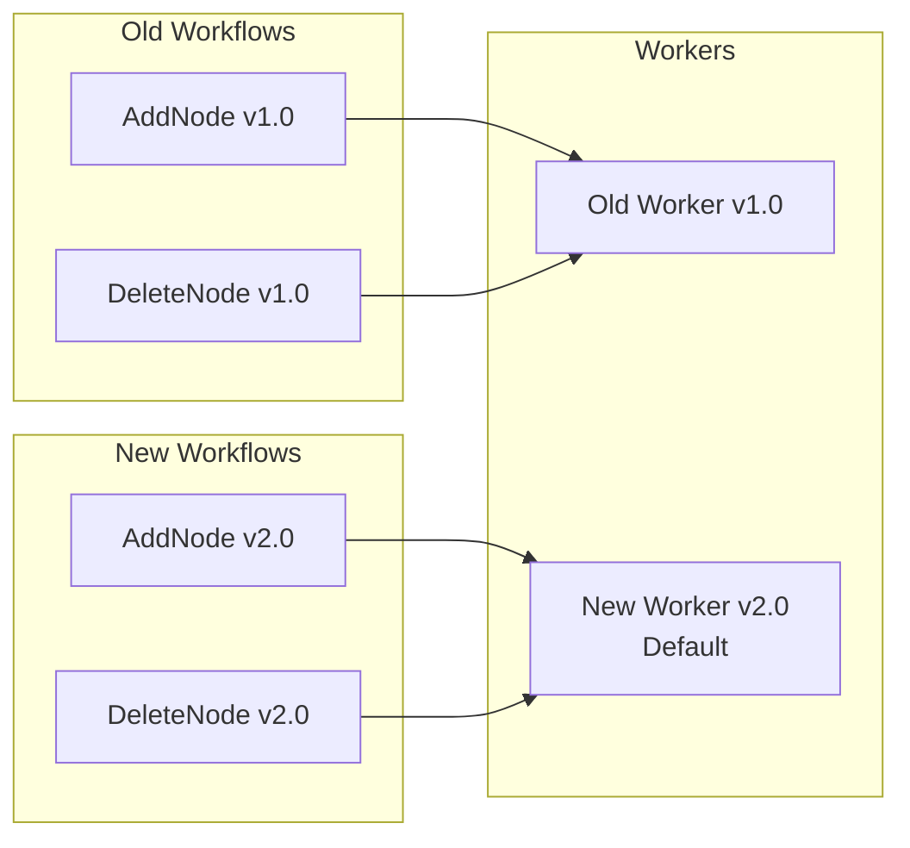

# Taming Complex Workflows

A Practical Guide to Temporal in Go

<!--
Ask how many know about temporal
-->

---
layout: quote
---

# What is temporal?

Temporal is a scalable and reliable runtime for durable function executions called Temporal Workflow Executions.
Said another way, it's a platform that guarantees the Durable Execution of your application code.

---
---

# Example

```go

// AddNode adds a node to kubernetes cluster.
func AddNode(ctx context.Context, input AddNodeInput) {
  CreateVM(ctx)
  // ... 
  WaitForVMReady(ctx)
  // ... 
  WaitForNodeToJoinCluster(ctx)
  // ... 
  PublishVMJoined(ctx)
}

```

<br>

<v-clicks>

- Indempotent
- Retryable
- Terminal
- Handle rollback
- Durable...

</v-clicks>

<!--
Action to AddNode with multiple steps
It should have some guarantees
-->

---
---
# What can we do (or how we did it)


<div v-click="1" v-motion
  :initial="{ x: -50 }"
  :enter="{ x: 0 }"
>
  PostgreSQL 
</div>


<div v-click="2" v-motion
  :initial="{ x: -50 }"
  :enter="{ x: 0 }"
>

Define and implement set of actions:
- Add Node
- Delete node
- ...
</div>

<div v-click="3" v-motion
  :initial="{ x: -50 }"
  :enter="{ x: 0 }"
>
Custom queue on top of database
</div>

<div v-click="4"
v-motion
  :initial="{ x: -50 }"
  :enter="{ x: 0 }"
 class="absolute right-10 top-30 w-100">

</div>

---
---

# What can we do (using temporal)

<div v-click="1" v-motion
  :initial="{ x: -50 }"
  :enter="{ x: 0 }"
>
Deploy temporal cluster

- Self-hosted
- Cloud

</div>

<div v-click="2" v-motion
  :initial="{ x: -50 }"
  :enter="{ x: 0 }"
>

Define and implement set of actions:
- Add Node
- Delete node
- ...
</div>

<div v-click="3" v-motion
  :initial="{ x: -50 }"
  :enter="{ x: 0 }"
>
Focus on business logic
</div>

<div v-click="[4,5]"
v-motion
  :initial="{ x: -50 }"
  :enter="{ x: 0 }"
 class="absolute right-30 top-32 w-66 h-80">

</div>

<div v-click="5"
 class="absolute right-10 top-30 w-100 h-80">

</div>

---
---
# What is temporal?

<v-clicks>

- Durable workflow engine
  - Peserves state of execution and resumes from where it left off
- Workflows are defined as a code (its not a drag and drop)
  - You define and maintain the code that temporal will run
  - The code is run on your side (in containers you deploy), temporal just orchestrates it
- Abstracts complexity of queues, state machines and retry logic
- Gives you visibility and debuggability of your workflows 
  - [Temporal UI](https://images.ctfassets.net/0uuz8ydxyd9p/6UY2CJG2StKj5Fnn4DXJp7/77746e861cb8275dac15fb1c70ac7ab1/ChildWorkflow2.png)
  - [Temporal Workflow UI](https://images.ctfassets.net/0uuz8ydxyd9p/4f1fU7KygHEDcazp8sZiSm/305aa92211b42e6a2172b6bc45b21056/Timeline5.png)
- ...
</v-clicks>


---
---

# Temporal building blocks

<div class="mt-6 space-y-6">

<div>
  <h3 class="text-1xl font-bold mb-3">Workflows</h3>
  <div class="grid grid-cols-2 gap-8 items-start">
    <div class="bg-gray-800 bg-opacity-50 p-2 rounded-lg">
      <p class="text-sm">A workflow defines a sequence of steps</p>
      <p class="text-xs">Example: AddNode, DeleteNode </p>
    </div>
    <ul class="space-y-2 text-sm">
      <li>Orchestrate activities and child workflows</li>
      <li>Maintain state and history</li>
      <li>Handle signals and queries</li>
      <li>Must be deterministic</li>
    </ul>
  </div>
</div>

<div>
  <h3 class="text-1xl font-bold mb-3">Activities</h3>
  <div class="grid grid-cols-2 gap-8 items-start">
    <div class="bg-gray-800 bg-opacity-50 p-2 rounded-lg">
      <p class="text-sm">Represent a single logical unit of work, but that unit can contain multiple operations</p>
      <p class="text-xs">Example: CreateVM, deleteVM </p>
    </div>
    <ul class="space-y-2 text-sm">
      <li>Can be non-deterministic</li>
      <li>Configurable retry policies</li>
      <li>Idempotent (ideally)</li>
    </ul>
  </div>
</div>

</div>

---
---

# Example with temporal

````md magic-move {lines: true}

```go 
// AddNode adds a node to kubernetes cluster.
func AddNode(ctx context.Context, input AddNodeInput) {
  resp, err := CreateVM(ctx, input)
  // ... 
  WaitForVMReady(ctx, resp)
  // ... 
  WaitForNodeToJoinCluster(ctx, input)
  // ... 
  PublishVMJoined(ctx, resp)
}
```

```go {2}
// AddNode adds a node to kubernetes cluster.
func AddNode(ctx worfklow.Context, input AddNodeInput) {
  resp, err := CreateVM(ctx, input)
  // ... 
  WaitForVMReady(ctx, resp)
  // ... 
  WaitForNodeToJoinCluster(ctx, input)
  // ... 
  PublishVMJoined(ctx, resp)
}
```

```go {3}
// AddNode adds a node to kubernetes cluster.
func AddNode(ctx worfklow.Context, input AddNodeInput) {
  resp, err := CreateVM(ctx, input)
  // ... 
  WaitForVMReady(ctx, resp)
  // ... 
  WaitForNodeToJoinCluster(ctx, input)
  // ... 
  PublishVMJoined(ctx, resp)
}
```

```go {3-6}
// AddNode adds a node to kubernetes cluster.
func AddNode(ctx worfklow.Context, input AddNodeInput) {
  var resp CreateVMOutput
  if err := workflow.ExecuteActivity(ctx, CreateVM, input).Get(ctx, &resp); err != nil {
    return err
  }
  // ... 
  WaitForVMReady(ctx, resp)
  // ... 
  WaitForNodeToJoinCluster(ctx, input)
  // ... 
  PublishVMJoined(ctx, resp)
}
```

```go {3-10}
// AddNode adds a node to kubernetes cluster.
func AddNode(ctx worfklow.Context, input AddNodeInput) {
  var resp CreateVMOutput
  if err := workflow.ExecuteActivity(ctx, CreateVM, input).Get(ctx, &resp); err != nil {
    return err
  }
  // ... 
  if err := workflow.ExecuteActivity(ctx, WaitForVMReady, resp).Get(ctx, nil); err != nil {
    return err
  }
  // ... 
  WaitForNodeToJoinCluster(ctx, input)
  // ... 
  PublishVMJoined(ctx, resp)
}
```

```go {8}
// AddNode adds a node to kubernetes cluster.
func AddNode(ctx worfklow.Context, input AddNodeInput) {
  var resp CreateVMOutput
  if err := workflow.ExecuteActivity(ctx, CreateVM, input).Get(ctx, &resp); err != nil {
    return err
  }
  // ... 
  if err := workflow.ExecuteActivity(ctx, WaitForVMReady, resp).Get(ctx, nil); err != nil {
    return err
  }
  // ... 
  WaitForNodeToJoinCluster(ctx, input)
  // ... 
  PublishVMJoined(ctx, resp)
}
```

```go 
// AddNode adds a node to kubernetes cluster.
func AddNode(ctx worfklow.Context, input AddNodeInput) {
  var resp CreateVMOutput
  if err := workflow.ExecuteActivity(ctx, CreateVM, input).Get(ctx, &resp); err != nil {
    return err
  }
  // ... 
  if err := workflow.ExecuteActivity(ctx, WaitForVMReady, resp).Get(ctx, nil); err != nil {
    return err
  }
  // ... 
  if err := workflow.ExecuteActivity(ctx, WaitForNodeToJoinCluster, input).Get(ctx, nil); err != nil {
    return err
  }
  // ... 
  if err := workflow.ExecuteActivity(ctx, PublishVMJoined, resp).Get(ctx, nil); err != nil {
    return err
  }
}
```

````

---
---

# Setup temporal worker

````md magic-move {lines: true}
```go {*|2|6|9-12}
func CreateWorker(c client.Client) worker.Worker {
  w := worker.New(c, "node_provisioner", worker.Options{})
  registerOptions := activity.RegisterOptions{...}

  // Workflows
  w.RegisterWorkflow(AddNode)

  // Activities
  w.RegisterActivityWithOptions(CreateVM, registerOptions)
  w.RegisterActivityWithOptions(WaitForVMReady, registerOptions)
  w.RegisterActivityWithOptions(WaitForNodeToJoinCluster, registerOptions)
  w.RegisterActivityWithOptions(PublishVMJoined, registerOptions)

  return w
}

```

````

---
---

# Schedule your workflow

```go
options := client.StartWorkflowOptions{
  ID:                       input.NodeID,
  TaskQueue:                "node_provisioner",
  WorkflowExecutionTimeout: 30 * time.Minute
}

client.ExecuteWorkflow(ctx, options, AddNode, input)

```

---
---

# Demo

[Temporal UI](http://localhost:8080)

---
---

# Lessons learned #1

Runtime errors
<div v-click="1">
```go {4}
// ExecuteActivity requests activity execution in the context of a workflow.
// ...
// ExecuteActivity immediately returns a Future that can be used to block waiting for activity result or failure.
func ExecuteActivity(ctx Context, activity interface{}, args ...interface{}) Future {
	return internal.ExecuteActivity(ctx, activity, args...)
}
```
</div>
<br>
<div v-click="2">
```go 
var out Out
if err := workflow.ExecuteActivity(ctx, "foo", "bar").Get(ctx, &out); err != nil {
  return err
}
```
</div>

---
---
# Lessons learned #1

Runtime errors
<v-clicks>

- Introduce helpers
  ```go
  func ExecuteActivity[Out, In any](ctx wf.Context, activity any, args In) (Out, error) {
  	var out CreateVMOutput
  	err := workflow.ExecuteActivity(ctx, activity, args).Get(ctx, &out)
  	return out, err
  }
  ```
  ```go
  resp, err := ExecuteActivity[CreateVMOutput](ctx, CreateVM, input);
  ```

- Unit tests
  ```go
  env.OnActivity(CreateVM, mock.Anything, expectedInput).Return(&CreateVMOutput{}, nil)
  ```

- Use protobuf contracts
  - https://github.com/cludden/protoc-gen-go-temporal

</v-clicks>

---
---

# Lessons learned #2

Define your activities

<v-clicks>

- Any function can be run as activity:
  ```go
  type Repository interface {
    GetNode(ctx context.Context, n Node) (*Node, error)
    CreateNode(ctx context.Context, n Node) (*Node, error)
    // ...
  }
  resp, err := ExecuteActivity[Node](ctx, Repository.CreateNode, input);
  ```
- Instead, make your activities explicit:
  ```go
  func (a *activity) CreateNode(ctx context.Context, in CreateNodeInput) (*CreateNodeOutput, err) {
    n, err := a.repo.GetNode(...)
    if err != nil && errors.Is(err, ErrAlreadyExists) {
      return nil, err
    }
    if n != nil {
      return CreateNodeOutput{n}, nil
    }

    return a.repo.CreateNode(...)
  }
  ```

</v-clicks>

---
---

# Lessons learned #3

Use distinct contracts for activities/workflows

<v-clicks>

- Instead of this:
  ```go
  func (a *activity) CreateNode(ctx context.Context, n *Node) (*Node, err) {}
  ```

- Do:
  ```go

    type struct CreateNodeInput {
      // ...
    }

    type struct CreateNodeOutput {
      // ...
    }
    func (a *activity) CreateNode(ctx context.Context, in CreateNodeInput) (*CreateNodeOutput, err) {}
  ```

</v-clicks>


---
---

# Lessons learned #4

Use hearbeats for long running activities

What will happen if I cancel/terminate workflow with long running activity?

<v-click>

- It will keep running 
- Without heartbeats, there's no way to proactively stop the activity - it will run to completion or until it times out based on configuration

</v-click>

<div v-click=2>

```go {*|*|8}
for {
		select {
		case <-ctx.Done():
			return ctx.Err()
		case <-time.After(wo.PollInterval):
		}

    activity.RecordHeartbeat(ctx)
    doPoll()
}
```
</div>


---
---

# Lessons learned #5

Define workflow IDs

<div v-click>

- Workflow ID can be used as uniqueness constraint

```go {2}
options := client.StartWorkflowOptions{
  ID: input.NodeID,
}
client.ExecuteWorkflow(ctx, options, AddNode, input)
```

</div>

<div v-click>

- Only one workflow can be "open" with given ID

</div>

<div v-click>

- You can control what happens if workflow with same ID is already running
  - Eg: cancel `AddNode` if `DeleteNode` has been scheduled

</div>

<div v-click>

```go {4}
func (c *client) executeWithTerminate(...) (client.WorkflowRun, error) {
	currentWorkflow, err := c.Client.DescribeWorkflowExecution(ctx, opts.ID, "")
	if currentWorkflow != nil && currentWorkflow.WorkflowExecutionInfo.Type.Name != workflow.GetName(newWorkflow) {
		opts.WorkflowIDConflictPolicy = enums.WORKFLOW_ID_CONFLICT_POLICY_TERMINATE_EXISTING
	}

	return c.ExecuteWorkflow(ctx, opts, newWorkflow, args)
}

```


</div>


---
---

# Lessons learned #6

Everything is a breaking change (almost)

Workflows must be deterministic - replaying the event history must produce the same outcome.

<v-clicks>

- Changing the order of activities, timers, or child workflows
  - Adding/removing activities in the middle of workflow logic
  - Changing condition logic that affects which activities execute
- Changing activity input/output types in incompatible ways
- ...
  
</v-clicks>

<br>

<div v-click>
Activity has no restrictions on the code it contains, but you still should be mindful

- Changing input parameter types in incompatible ways
- Changing output type in incompatible ways

</div>


---
---

# Lessons learned #7

You need versioning (eventually)

<v-clicks>

- Poor man's versioning:
  ```go
  AddNode -> AddNodeV2
  // ...
  w.RegisterWorkflow(AddNode)
  w.RegisterWorkflow(AddNodeV2)
  ```

- Introduce versioning in workflow code
  ```go
  v := wf.GetVersion(ctx, "switch-activities", wf.DefaultVersion, 1)
  if v == wf.DefaultVersion {
    err = wf.ExecuteActivity(ctx, oldActivity, input)
  } else {
    err = wf.ExecuteActivity(ctx, newActivity, input)
  }
  ```

</v-clicks>

---
---

# Lessons learned #7

You need versioning (eventually)

<div v-click="1">

- Worker versioning
  - Allows running multiple versions of workflows simultaneously
</div>

<div v-click="1" class="absolute right-10 top-30 w-110 text-right">



</div>

<div v-click="2">

- [K8s Temporal Worker Controller](https://github.com/temporalio/temporal-worker-controller/tree/main)

</div>

---
---
# Questions?

Slides: https://varnastadeus.github.io/temporal-golang-meetup